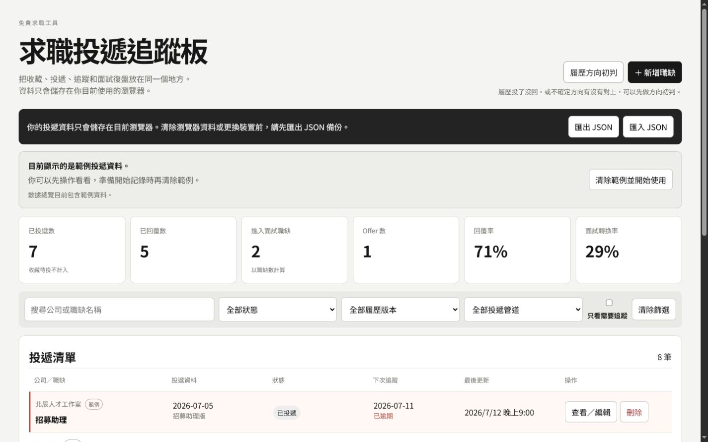
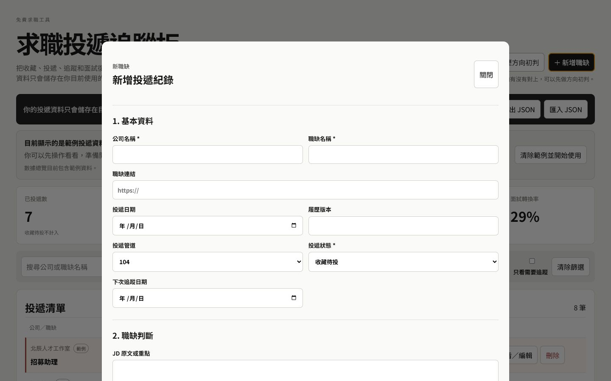

# 求職投遞追蹤板

一個免費、免登入、資料留在本機的 Windows 求職管理工具。

把收藏職缺、投遞進度、追蹤日期、履歷版本與面試復盤放在同一個地方，不用再散落在 Excel、記事本、瀏覽器分頁和對話紀錄裡。

- 目前版本：v1.0.0 Beta
- 支援系統：Windows 10／11 x64
- 發布形式：ZIP 免安裝版
- 資料方式：本機儲存，不上傳伺服器
- [最新版本下載](https://github.com/vampirehollieee/job-application-tracker/releases/tag/v1.0.0-beta)
- [履歷方向初判](https://resume-intake-v1-260710.mar227392.chatgpt.site/intake/form/)

## 產品截圖

畫面中的公司、職缺與紀錄皆為虛構範例資料。

## 這個工具解決什麼問題

求職紀錄常散落在求職平台、Excel、記事本、瀏覽器分頁與對話紀錄裡。時間一久，很容易忘記投過哪一版履歷、何時該追蹤，或面試後沒有留下可用的復盤。

這個工具把核心流程集中在同一個地方：

**收藏職缺 → 投遞 → 追蹤 → 面試 → 復盤 → 結案**

## 主要功能

- 記錄公司、職缺名稱與職缺連結
- 管理投遞日期與投遞管道
- 標記每次使用的履歷版本
- 追蹤收藏待投、已投遞、面試、Offer 與結案等狀態
- 設定下次追蹤日期並提示今天到期或已逾期
- 整理 JD 原文、摘要、應徵動機、符合條件與可能落差
- 建立多筆面試紀錄與面試復盤
- 依公司、職缺、狀態、履歷版本與管道搜尋、篩選
- 顯示投遞、回覆、面試、Offer 與轉換率統計
- 使用 JSON 匯入／匯出完整備份
- 提供 8 筆虛構範例資料，第一次開啟即可了解操作方式
- 保留履歷方向初判入口，在投遞前協助整理方向

## 下載與使用

1. 前往 [Releases](https://github.com/vampirehollieee/job-application-tracker/releases/tag/v1.0.0-beta) 下載 Windows ZIP。
2. 將 ZIP 完整解壓縮到一個資料夾。
3. 開啟資料夾內的「求職投遞追蹤板.exe」。
4. 確認範例畫面後，點選「清除範例並開始使用」開始記錄。

> **請勿只單獨移動 EXE。** `resources`、`locales`、DLL 與其他檔案都是程式正常運作所需內容。

## 資料與隱私

- 不需登入帳號
- 不連接後端服務
- 不會把投遞資料上傳到伺服器
- 資料儲存在使用者自己的 Windows 本機
- 網頁版與 Windows 版不會自動同步
- 更換電腦、清除資料或重裝前，請先匯出 JSON 備份

## 從需求到工具落地

這個專案呈現從問題觀察、產品定義到 Windows 成品發布的完整過程：

1. 從社群討論觀察求職投遞管理痛點。
2. 定義欄位、狀態與使用流程。
3. 使用 GPT／Codex 協作開發。
4. 建立 React／TypeScript MVP。
5. 加入本機儲存、備份與防呆。
6. 完成響應式介面。
7. 處理 Vite／Electron／Windows 封裝問題。
8. 放棄不穩定的 NSIS Portable 單檔。
9. 改採 Windows ZIP 免安裝版。
10. 完成 GitHub Repository 與 Release。

它可作為：

- AI 落地案例
- 產品需求拆解案例
- 行銷企劃案例
- 社群洞察轉成工具的實作證據

## 設計邊界

目前刻意不做：

- 會員登入
- 雲端同步
- 後端資料庫
- 多人協作
- 自動抓取職缺
- AI 自動判讀履歷
- 自動更新
- 安裝程式
- 長期客服型 SaaS

## 技術棧

- React
- TypeScript
- Vite
- Electron
- Electron Builder
- Vitest
- localStorage
- GitHub Releases

## 驗證結果

- 3 個測試檔
- 21／21 測試通過
- Production build 成功
- Electron 開發模式啟動成功
- win-unpacked 建置成功
- GitHub Release ZIP 實際下載、解壓、開啟成功
- 新增、編輯與資料保存已驗收
- JSON 匯入／匯出與資料驗證已通過

## Beta 限制

- 僅支援 Windows 10／11 x64
- 尚未提供自動更新
- 新版需重新下載 ZIP
- 未簽章，Windows 可能顯示安全提醒
- 不支援跨裝置同步
- 建議定期匯出 JSON

## 製作

職缺避雷針／東尼

[履歷方向初判](https://resume-intake-v1-260710.mar227392.chatgpt.site/intake/form/)
